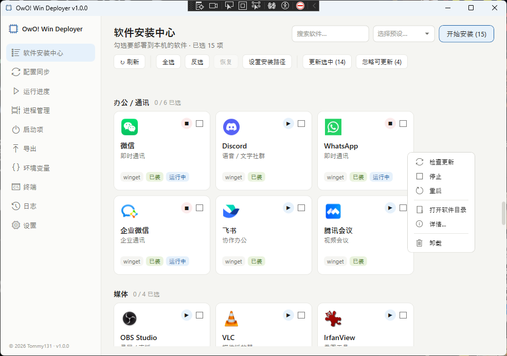
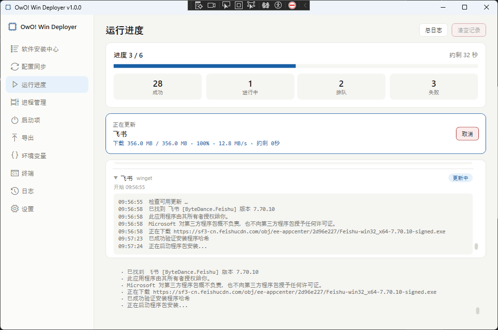
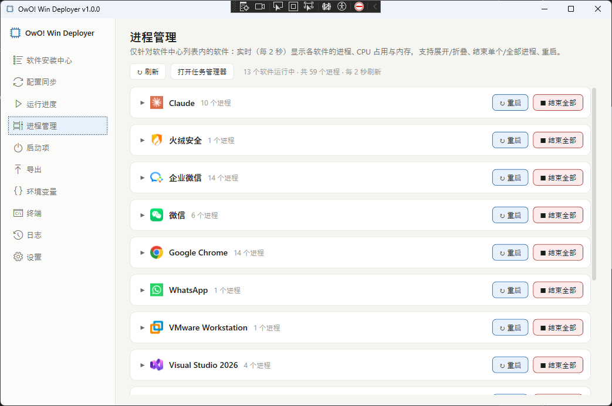
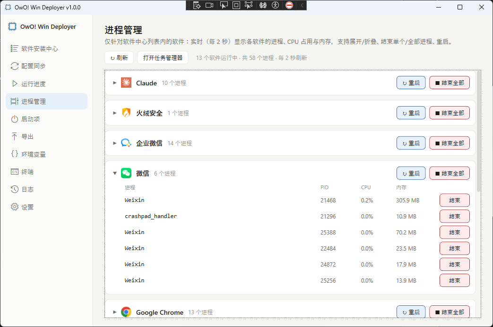
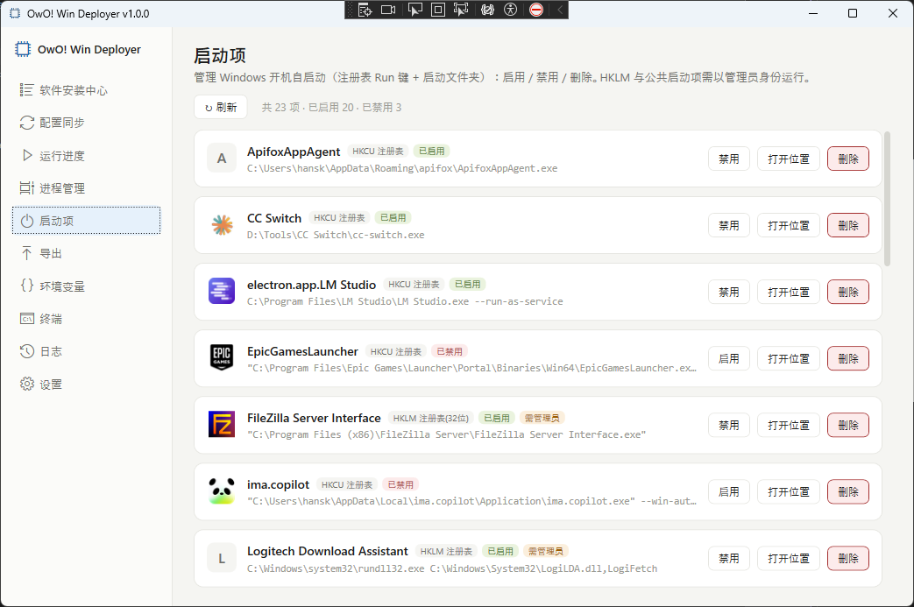
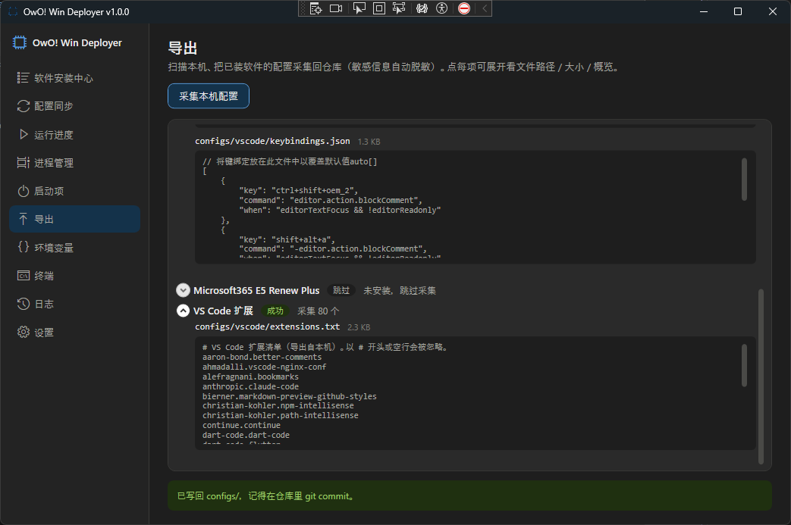
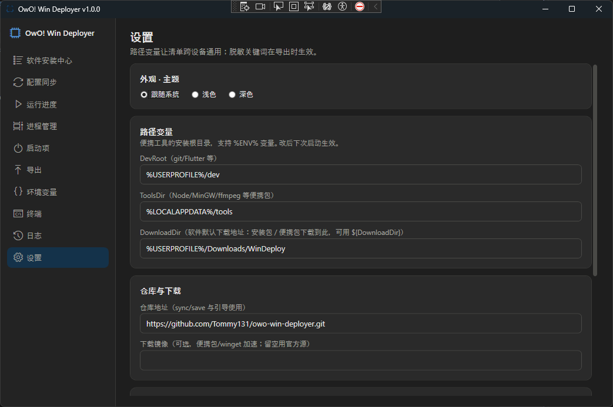
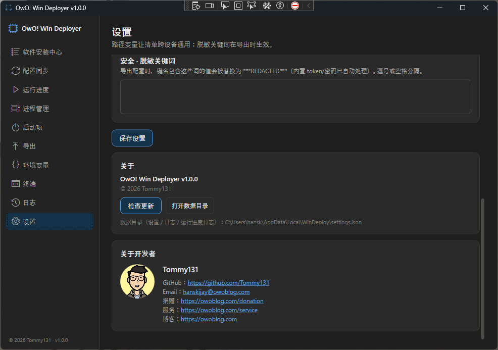
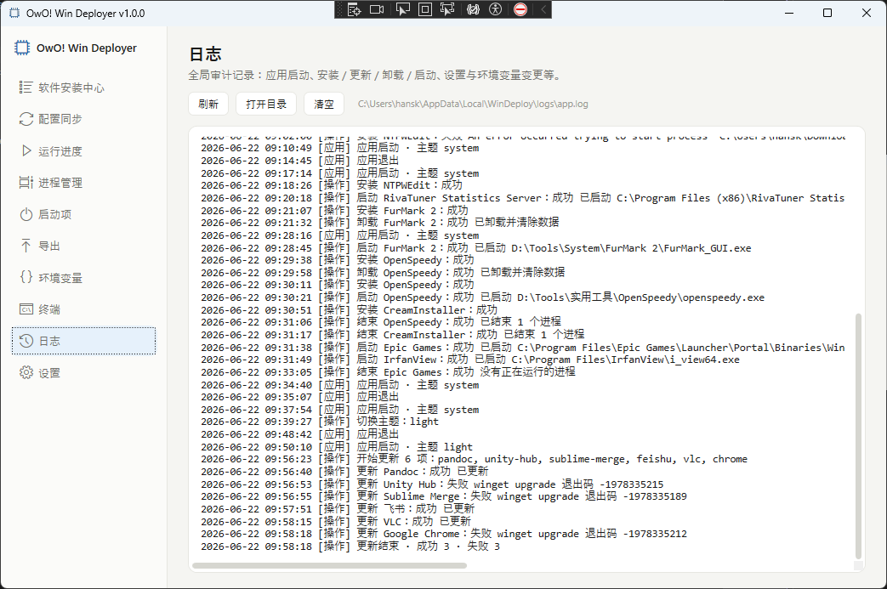

# OwO! Win Deployer (owo-win-deployer)

> [!CAUTION]
> # ⛔ 请不要 Fork 本项目！⛔
>
> **当前处于不稳定版本更新阶段，可能会重写 Git 历史提交记录、增删文件。**
>
> - 🚫 **不要提交 Pull Request** —— 本项目**不会处理任何不受信任的 Pull Request**。
> - ✅ 使用过程中遇到问题，请**直接提交 [Issue](../../issues)**。
> - ⚠️ Fork 后随时可能因历史重写而与上游彻底冲突，请勿 Fork。

---

一键在任意 Windows 设备上**复刻开发环境、应用与个人配置**，并集成系统管理、终端、FTP、进程/服务管理等专业工具。完整设计文档见 [`docs/DESIGN.md`](docs/DESIGN.md)。

## 目录

- [界面预览](#界面预览-screenshots)
- [功能概览](#功能概览)
- [项目架构](#项目架构)
- [快速开始](#快速开始)
- [构建与开发](#构建与开发需要-net-sdk-10)
- [CLI 命令参考](#cli-命令参考)
- [软件目录](#软件目录-catalog)
- [使用须知](#使用须知)
- [版权许可](#版权许可-license)

---

## 界面预览 Screenshots

| 软件安装中心（卡片勾选 · 右键菜单） | 运行进度（实时下载 / 安装日志） |
| :---: | :---: |
|  |  |
| **进程管理（按软件分组）** | **进程管理（展开进程树 · CPU / 内存）** |
|  |  |
| **启动项管理** | **配置导出（自动脱敏）** |
|  |  |
| **设置 · 主题 / 路径变量 / 仓库** | **关于 / 开发者** |
|  |  |
| **运行日志** | |
|  | |

---

## 功能概览

所有里程碑均已完成：

| 里程碑 | 核心内容 | 状态 |
|:---:|---|:---:|
| M1 | 安装引擎（winget / portable / git / conda / vscode-ext / script）+ 幂等检测 + 路径变量 + CLI | ✅ |
| M2 | 配置套用 / 采集 + 导出脱敏 + 环境变量管理 + SSH 每台独立生成 | ✅ |
| M3 | WPF 软件安装中心（图标卡片逐项勾选）+ 实时进度 + 配置 / 导出页面 | ✅ |
| M4 | 自包含单文件发布 + Release CI + 多机同步（sync / save）+ 版本锁定 | ✅ |
| M5 | 系统管理与专业工具（终端 · FTP · 进程 · 服务 · 概览 · 维护 · WSL · 调优）+ 开发人员模式 | ✅ |

### 软件安装中心（M1 · M3）

- **450+ 软件**按类别以图标卡片展示，逐项勾选或整组选择
- **搜索**过滤 + **预设 Profile** 一键切换（`dev` / `full` / `ai-station`）
- **安装方式**：winget · winget-bundle · portable · git · conda · vscode-ext · exe · script · github-release · local · manual
- **幂等安装**：检测已装则自动跳过，支持 dry-run 预演
- 右键菜单：安装 / 卸载 / 启动 / 停止 / 重启 / 更新 / 查看日志
- 实时进度：下载速度、ETA、单项状态、滚动日志尾

### 配置同步（M2）

- **套用 / 采集**双向：VS Code · Git · SSH · 环境变量 · Windows Terminal · PowerShell · npm · conda · pip
- 导出自动**脱敏**（token / 密钥 / API key），自定义脱敏关键词
- SSH 密钥**每台设备独立生成**（ed25519），支持一键登记到 GitHub，私钥永不入库
- 套用前自动备份（`.bak.yyyyMMdd-HHmmss`）

### 多机同步（M4）

- `catalog/lock.json` 锁定版本，跨机可复现
- `git pull` → 套用配置 + 显示安装计划（`sync` 命令）
- 主机名 → 预设映射（`catalog/hosts.json`），多机自动识别角色
- 迁移工具包：一键打包 configs + 软件清单，迁移到新机器

### 终端（M5）

- **ConPTY 伪控制台**：完整支持 PowerShell / cmd / ssh / vim 等交互式程序与密码输入
- **VT100/ANSI 模拟器**：16 色 / 256 色 / 24 位真彩色，滚动缓冲 5000 行
- **多会话**：标签式多终端，内置 Shell 目录（可配置 PowerShell / cmd / WSL 等），会话可命名编辑
- **视觉特效**：Hacker-FX（绿磷光 · 辉光 · 扫描线）+ CodeRain 数字雨，可在设置中独立切换并持久化
- Shell 切换、调整终端尺寸（自动通知 PTY resize）；关闭前确认弹窗防止误关

### FTP 服务器 & 客户端（M5）

- **自托管 FTP/FTPS 服务器**：自定义端口、主被动模式、TLS 加密、并发数限制
- **用户 / 权限组管理**：精细化读写权限，MLSD 权限位预告知客户端（自动禁用无权限操作）
- **自动签发 TLS 证书**（自签名 X.509 RSA 2048-bit，无需手动 openssl）
- **FTP 客户端**：双栏文件浏览，本地 / 远程双侧右键菜单（打开 / 上传 / 下载 / 重命名 / 删除）
- **多选批量传输**：Ctrl/Shift 多选文件夹与文件，批量上传 / 下载 / 删除；资源管理器风格右键保持多选
- **实时传输速度 + ETA**：预扫描总大小，每 0.5 秒采样刷新进度
- **站点管理器（Saved Logins）**：保存常用登录信息，密码经 DPAPI 加密存储，快速重连
- 15 秒连接 / TLS 超时保护；配置持久化（端口 / TLS / 编码 / 限速等）

### 进程管理（M5）

- **按软件分组树状视图**：CPU / 内存实时显示
- 支持过滤、批量操作（启动 / 杀进程 / 重启）
- 从运行中进程提取图标，分组归类

### 系统概览（M5）

- CPU · 内存 · 磁盘（含 NVMe S.M.A.R.T.）· 电池 · Windows 激活状态
- NVMe SMART 详细属性表 + 健康日志
- 磁盘类型识别：NVMe / SSD / HDD / USB
- 一键导出本机软件清单（CSV / HTML / JSON）

### 系统维护（M5）

- **修复工具**：一键 SFC · DISM /RestoreHealth · chkdsk（按需 UAC 提权）
- **网络重置**：重置 TCP/IP 栈 · Winsock · DNS 缓存
- **缓存清理**：Temp · Windows Update 缓存 · 缩略图 · Windows.old
- **图标缓存重建**
- **事件速诊**：最近 7 天严重 / 错误事件摘要

### WSL（M5 · 开发人员模式）

- 发行版列表 · 在线安装 · 设为默认 · 启动 / 停止
- 导出备份（TAR）· 注销

### 系统调优（M5 · 开发人员模式）

- 可逆注册表调整，实时读取当前状态，一键开关：
  - 显示文件扩展名 / 显示隐藏文件
  - 深色 / 浅色模式
  - 经典右键菜单（Win11）
  - 关闭遥测 · 其他常用 Explorer 选项

### 服务管理（M5）

- Windows 服务启动类型配置（自动 / 手动 / 禁用）
- 启动 · 停止 · 重启 · 状态实时监控

### 启动项管理（M5）

- 读写注册表 `Run` / `RunOnce`（HKCU + HKLM）
- 启用 / 禁用，审计记录

### 高级工具（M5 · 开发人员模式）

- 环境体检（PATH 重复 / 失效 · `*_HOME` 变量验证）
- catalog 校验（CI 友好，异常退出码 1）
- 生成 `lock.json`（版本快照）
- 导出 `winget configure` DSC YAML（供 Intune / GPO / SCCM）
- 离线部署包（预下载 + 打包）
- 迁移工具包导出 / 还原

### 系统托盘（M5）

- 最小化到托盘后台运行，不占任务栏
- 托盘右键快捷菜单：一键启动 / 停止 / 重启 FTP 服务器，显示缓存的服务运行状态（异步探测）
- 快速导航到主窗口各功能页

### 应用稳定性

- **全局崩溃处理器**：捕获 UI 线程、AppDomain 及 Task 中的未处理异常，写入 `crash.log` 并弹出错误对话框，确保程序不无故退出到桌面

### 设置与外观

- 浅色 / 深色主题，实时切换
- 路径变量配置（`${DevRoot}` / `${ToolsDir}`）
- 配置仓库地址、镜像源
- 脱敏关键词自定义
- **开发人员模式**门控（解锁 WSL · 调优 · 高级工具 · 终端高级功能）

---

## 项目架构

```
owo-win-deployer/
├── src/
│   ├── WinDeploy.Core/          # 纯库：安装引擎、配置同步、数据模型
│   │   ├── Catalog/             # JSON 解析、Profile 解析
│   │   ├── Engine/              # 安装编排、检测、方法派发
│   │   ├── Config/              # 配置套用 / 采集 / 脱敏
│   │   ├── Export/              # DSC 导出、软件清单、迁移包
│   │   ├── Models/              # 数据模型
│   │   └── Util/                # 日志、进程、路径工具
│   ├── WinDeploy.Cli/           # CLI 入口（薄包装，转发到 Core）
│   └── WinDeploy.App/           # WPF GUI（自包含单文件）
│       ├── Views/               # 20+ 页面 + 对话框
│       ├── ViewModels/          # 对应 ViewModel（MVVM）
│       ├── Services/            # 40+ 系统集成服务
│       └── Behaviors/           # 自定义 UI 行为
├── catalog/
│   ├── catalog.json             # 软件主清单（450+ 条目）
│   ├── profiles/                # 安装预设（dev · full · ai-station）
│   └── hosts.example.json       # 主机名→预设映射模板
├── configs/                     # 配置仓库（与安装状态解耦）
│   ├── vscode/                  # settings.json · keybindings.json
│   ├── git/                     # .gitconfig
│   ├── ssh/                     # config · known_hosts（无私钥）
│   ├── env/                     # env.json（自定义 PATH / 环境变量）
│   ├── pwsh/                    # PowerShell Profile
│   ├── windows-terminal/        # settings.json
│   ├── nodejs/                  # .npmrc
│   ├── python/                  # pip.ini
│   └── miniconda/               # .condarc
├── bootstrap/
│   └── bootstrap.ps1            # 裸机引导脚本
├── scripts/
│   └── publish.ps1              # 构建发布（自包含单 EXE）
├── docs/
│   └── DESIGN.md                # 完整设计文档（权威来源）
├── assets/                      # 图片 · 图标资源
├── .github/
│   └── workflows/release.yml   # Release CI（打 tag 自动构建）
└── WinDeploy.sln
```

### 分层说明

| 层 | 项目 | 说明 |
|---|---|---|
| 引擎层 | `WinDeploy.Core` | 纯 .NET 10 库，**不依赖注册表 / WMI**（CLI 和 GUI 均可调用） |
| CLI 层 | `WinDeploy.Cli` | 薄包装，暴露 13 条命令，适合脚本 / CI 场景 |
| GUI 层 | `WinDeploy.App` | WPF MVVM，系统集成（WMI · ConPTY · P/Invoke）仅在此层 |

### 关键设计原则

- **数据 / 引擎分离**：`catalog.json` 只是数据，加软件只改 JSON 不动引擎
- **幂等安装**：先检测再安装，重复运行安全
- **路径变量化**：`${DevRoot}` / `${ToolsDir}` 首次设定，跨机通用
- **安全优先**：SSH 私钥每台独立生成永不入库；导出 token / 密钥自动脱敏
- **开发人员模式门控**：注册表 / WSL / 高级功能通过确认弹窗二次验证

---

## 快速开始

### 裸机引导（目标机无需预装 .NET）

```powershell
irm https://raw.githubusercontent.com/Tommy131/owo-win-deployer/main/bootstrap/bootstrap.ps1 | iex
```

脚本会自动确认 winget 可用、从 GitHub Release 下载最新版 `WinDeploy.exe` 并启动。

### 直接下载

前往 [Releases](../../releases) 页面，下载 `WinDeploy.exe`（GUI）或 `windeploy.exe`（CLI）。

> **推荐下载 ZIP 版**：ZIP 内为文件夹版（exe + 运行库），触发杀软启发式的概率低于单文件自解压版。

---

## 构建与开发（需要 .NET SDK 10）

```powershell
# 构建整个解决方案
dotnet build WinDeploy.sln

# 运行 GUI（软件安装中心）
dotnet run --project src/WinDeploy.App

# 运行 CLI
dotnet run --project src/WinDeploy.Cli -- list
dotnet run --project src/WinDeploy.Cli -- plan  --profile dev
dotnet run --project src/WinDeploy.Cli -- apply --profile dev --yes
```

### 发布（自包含单文件，目标机免装 .NET）

```powershell
pwsh -File scripts/publish.ps1
# 产出：artifacts/app/WinDeploy.exe（GUI）
#       artifacts/cli/windeploy.exe（CLI）
```

推送 `v*` tag 后，`.github/workflows/release.yml` 自动构建并挂到 GitHub Release。

---

## CLI 命令参考

```
windeploy <命令> [选项]
```

| 命令 | 说明 |
|---|---|
| `list` | 列出 catalog 全部软件（可加 `--category` 筛选） |
| `plan` | 显示安装 / 已装计划（不执行，dry-run） |
| `apply` | 执行安装（`--silent` 无人值守 · `--locked` 按 lock.json 钉版本 · `--log <文件>` 落日志） |
| `apply-config` | 套用配置（VS Code / Git / env… 按 `applyWhen` 策略） |
| `export` | 采集本机配置回写仓库（自动脱敏 token / 密钥） |
| `ssh-setup [--register]` | 生成本机 ed25519 SSH 密钥并套用 ssh 配置（`--register` 自动登记到 GitHub） |
| `sync` | `git pull` → 套用配置 + 显示安装计划 |
| `save [--message m] [--push]` | 提交 configs 改动（`--push` 推送远程） |
| `doctor` | 环境体检：PATH 重复 / 失效、`*_HOME` 失效、已装但不在 PATH |
| `validate` | 校验 catalog.json（CI 友好，有错误时退出码 1） |
| `lock` | 采集已装版本写入 `catalog/lock.json`（跨机可复现） |
| `export-dsc [--out f]` | 导出为 `winget configure` DSC YAML，供 Intune / GPO / SCCM 无人值守 |
| `inventory [--format csv\|json\|html] [--out f]` | 导出本机已装软件清单 |
| `download-only [--out d]` | 仅预下载所选软件安装包（离线 / U 盘部署） |
| `migrate --export <目录> \| --import <目录>` | 迁移工具包导出 / 还原（configs + 软件清单） |

### 常用选项

| 选项 | 说明 |
|---|---|
| `--profile <名称>` | 指定预设（`dev` / `full` / `ai-station`） |
| `--select <id,…>` | 追加选择软件（支持 `@category:dev`） |
| `--deselect <id,…>` | 排除软件 |
| `--yes` / `-y` | 跳过确认提示 |
| `--silent` | 静默安装（传 `--silent` 给 winget） |
| `--locked` | 按 `lock.json` 中的固定版本安装 |

---

## 软件目录 Catalog

`catalog/catalog.json` 包含 **450+ 条目**，按类别分组：

| 类别 | 典型软件 |
|---|---|
| `dev` | git · gh · Node.js · Python · Miniconda · PowerShell · JDK · Go · .NET SDK · CMake · FFmpeg · MinGW · Flutter |
| `system` | VC++ Runtime · Windows Terminal · 火绒安全 |
| `ide` | VS Code（含 80 个扩展）· Visual Studio · Android Studio · Sublime Merge |
| `ai` | ComfyUI · LM Studio · Ollama · llama.cpp · Claude · Windsurf · Hermes Agent · Codex |
| `office` | 微信 · Discord · WhatsApp · 企业微信 · 飞书 · 腾讯会议 |
| `media` | OBS · VLC · IrfanView · 网易云音乐 |
| `db-api` | DBGate · Apifox · WinSCP |
| `vm` | VMware |
| `games` | Steam · Epic Games |
| `proxy` | V2RayN · CC Switch |
| `browser` | Chrome |
| `hwmon` | HWiNFO · CPU-Z · GPU-Z · CrystalDiskMark · FurMark · MSI Afterburner · CrystalDiskInfo |
| `tools` | Snipaste · ScreenToGif · 7-Zip · PowerToys · Everything · ShareX · Typora · uTools |

### 内置预设 Profile

| 预设 | 包含 | 典型场景 |
|---|---|---|
| `dev` | dev + system + VS Code + Windows Terminal | 精简开发工作站 |
| `full` | 除游戏客户端外的全部 | 全功能机器 |
| `ai-station` | dev + system + ai + VS Code | AI 推理 / 训练工作站 |

### 扩展 catalog

只需编辑 `catalog/catalog.json`，引擎无需修改。每条目示例：

```jsonc
{
  "id": "nodejs",
  "name": "Node.js 24",
  "category": "dev",
  "default": true,
  "install": { "method": "winget", "id": "OpenJS.NodeJS" },
  "detect": { "cmd": "node" },
  "config": {
    "source": "configs/nodejs",
    "files": [".npmrc"],
    "applyWhen": "ifInstalled"
  }
}
```

---

## 使用须知

### 系统要求

| 项目 | 要求 |
|---|---|
| 操作系统 | Windows 10 1809（Build 17763）及以上；终端功能需 Windows 10 1809+ |
| 架构 | x64 |
| 运行依赖 | 无（自包含，免装 .NET） |
| 构建依赖 | .NET SDK 10（仅开发者需要） |
| 网络 | 联网安装软件；离线包需提前 `download-only` |
| 权限 | 部分功能（SFC · DISM · chkdsk · 系统级 PATH）需管理员权限，程序将按需 UAC 提权 |

### 被 Windows 拦截 / 提示「未知发布者」怎么办

本程序目前**未做代码签名**，属于「自动装软件」类工具，Windows SmartScreen / Defender 可能拦截或提示「未知发布者」。**这不是病毒**（源码与构建流水线全部公开）。

| 情况 | 处理方式 |
|---|---|
| SmartScreen 蓝色弹窗 | 点「更多信息 → 仍要运行」 |
| 优先下载 ZIP 版 | 解压后运行文件夹内 `WinDeploy.exe`，比单文件版触发杀软的概率低 |
| Defender 删除 / 隔离 | 「Windows 安全中心 → 病毒和威胁防护 → 保护历史记录」恢复文件；可在 [Microsoft 误报提交](https://www.microsoft.com/wdsi/filesubmission) 报告 |
| 彻底解决（开发者） | 配置仓库 Secrets：`SIGN_PFX_BASE64` + `SIGN_PFX_PASSWORD`，Release CI 已内置 Authenticode 签名步骤 |

### 开发人员模式

WSL、系统调优、高级工具等专业功能通过**开发人员模式**门控。在「设置 → 开发者选项」启用后，左侧导航立即出现对应页面。启用时会弹出二次确认弹窗，请仔细阅读提示后再操作。

### 安全说明

- **SSH 私钥**：每台设备独立生成，绝不写入 `configs/` 仓库
- **配置脱敏**：导出时自动识别并删除 token、password、api_key、secret 等字段，可在「设置 → 脱敏关键词」自定义
- **注册表操作**：系统调优页面所有改动均可在同一页面**一键复原**
- **UAC 提权**：仅在需要时（SFC / DISM / 系统级 PATH 写入）发起，不长期持有管理员权限

### 已知限制

- `mingw` 条目含占位 URL，使用前请在 `catalog.json` 中补全实际下载地址
- ConPTY 终端功能需要 Windows 10 Build 17763+，更旧系统终端页面不可用
- 部分 winget ID 以 `TODO:` 标注，安装前请先 `validate` 校验

---

## 版权许可 License

本项目对外采用 **CC BY-NC-SA 4.0**（署名 - 非商业性使用 - 相同方式共享 4.0 国际）许可，完整条款见 [`LICENSE`](LICENSE)。

### 许可摘要

| 权利 | 说明 |
|---|---|
| **署名（BY）** | 使用须保留作者版权声明，并注明是否有改动 |
| **非商业（NC）** | 禁止将本项目或其衍生作品用于商业用途 |
| **相同方式共享（SA）** | 修改 / 二次开发后再发布，必须以相同许可证开源 |

### 允许的使用

- 个人学习、研究、非商业项目
- 在遵守上述三项条件的前提下复制、修改、再分发

### 禁止的使用

- 将本项目或其衍生版本用于任何商业产品、服务或盈利目的
- 以闭源方式发布基于本项目的修改版本
- 移除或篡改版权声明

### 作者特权

作者 **Tommy131** 为唯一版权持有人，**不受「非商业」限制约束**，保留包括商业使用与另行授权（双重许可）在内的全部权利。

**商业授权咨询**：hanskijay@owoblog.com

---

Copyright © 2026 Tommy131 · <https://github.com/Tommy131>
