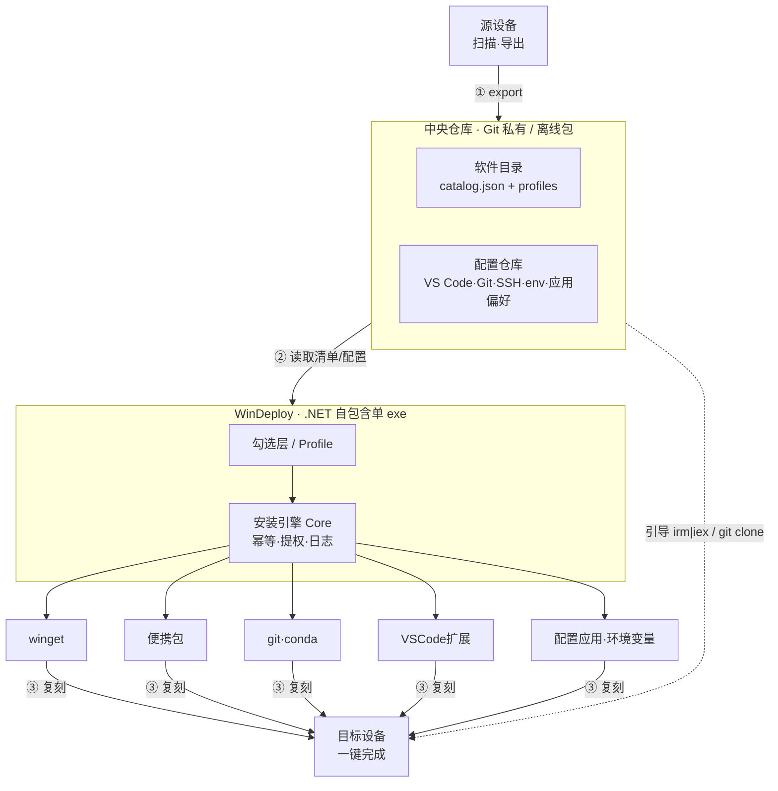

# OwO! Win Deployer（owo-win-deployer）设计文档

> 一键在任意 Windows 设备上复刻你的开发环境、应用与个人配置。
>
> 版本：Draft v0.3 · 日期：2026-06-20 · 仓库：`Tommy131/owo-win-deployer`
> 实现状态：M1 引擎 / M2 配置同步 / M3 GUI / M4 发布·多机同步 **均已实现**（见 git 历史与 README）。

---

## 1. 项目概述

### 1.1 定位

一个 **Windows 环境复刻器**：在一台全新（或现有）设备上运行后，按你的选择自动安装开发工具链、应用软件，并同步个人配置（VS Code 设置、Git 配置、环境变量等），把"每台机器手动下载安装部署"的几小时压缩到一次点击 + 等待。

它**不只是安装器**——即便某个软件本次不安装，它的偏好配置也始终随仓库携带，等哪天装上即可一键套用。

### 1.2 痛点

- 多设备（工作站 / 笔记本 / 虚拟机）重复部署，每台都要逐个下载、安装、配 PATH、导扩展、调设置。
- 手动安装的便携工具（Node、MinGW、ffmpeg…）散落在固定路径，换机即失效。
- 配置（VS Code、Git、SSH host、环境变量）无统一管理，难以跨机一致。

### 1.3 核心理念

| 理念 | 含义 |
|---|---|
| 声明式 | 「装什么、怎么装、配什么」全部写在数据文件里，引擎只负责执行 |
| 幂等 | 已装则跳过，可反复运行、随时中断重来 |
| 可复现 | 便携包钉版本 + 校验；路径变量化，一份清单跨机通用 |
| 解耦 | 数据（清单 + 配置）与引擎分离；配置与是否安装分离 |
| 零依赖落地 | 目标机无需预装任何运行时即可启动 |
| 安全优先 | 私钥永不入库；敏感信息脱敏或排除 |

---

## 2. 核心需求

### 2.1 功能性需求（FR）

- **FR-1 逐项选择**：以「单个软件」为粒度勾选，类别仅用于分组，非整包安装（例：只装 Steam 客户端本体，不装游戏）。
- **FR-2 默认分层**：每项有默认状态——开发工具链 + 系统依赖默认预选（强制），个人类默认不选、安装前逐项询问。
- **FR-3 五种安装方式**：`winget` / `winget-bundle` / `portable`(下载解压+PATH) / `git`(克隆+PATH) / `conda`(环境定义重建) / `vscode-ext`(批量扩展) / `script`(自定义后置)。
- **FR-4 配置同步（解耦）**：VS Code 设置+键位+扩展、Git 全局配置、SSH host/known_hosts、自定义环境变量 & PATH、应用偏好（如 LM Studio）。配置常驻仓库，与是否安装无关。
- **FR-5 导出 / 应用双模式**：`export` 扫描本机回写仓库；`apply` 在目标机复刻。
- **FR-6 Profile 预设**：dev / full / ai-station 等命名预设，选一个再在 GUI 微调。
- **FR-7 路径变量化**：清单中路径用 `${DevRoot}`、`${ToolsDir}` 等变量，首次运行设定一次。
- **FR-8 SSH 每台新生成**：生成 ed25519 新密钥，经 `gh` 自动登记 GitHub，其它服务器给出公钥登记清单。
- **FR-9 多机同步闭环**：A 机导出→push；B 机 pull→apply；GUI 提供「同步」入口。
- **FR-10 幂等重入 + 报告**：检测已装状态，结束给出安装/跳过/失败汇总，支持 dry-run。

### 2.2 非功能性需求（NFR）

- **NFR-1 裸机零依赖**：自包含单文件 exe，目标机免装 .NET。
- **NFR-2 跨设备可移植**：不假设 D 盘存在；所有机器相关路径变量化。
- **NFR-3 安全**：仓库私有；SSH 私钥不入库；配置内 token/密码脱敏或排除。
- **NFR-4 可维护**：数据（catalog/configs）与引擎（Core）彻底分离，加新软件只改 JSON。
- **NFR-5 可观测**：结构化日志 + 人类可读汇总。
- **NFR-6 离线支持**：便携包可走 GitHub Release / 局域网离线包。
- **NFR-7 提权最小化**：需要管理员的操作集中，一次性提权（elevate-once）。

---

## 3. 范围边界

| 纳入 ✅ | 排除 ❌ |
|---|---|
| 开发工具链、IDE、CLI 工具 | NVIDIA 驱动 / 显卡 App（交给厂商自更新） |
| 应用软件（AI / 办公 / 媒体 / 数据库 / API 等，逐项可选） | 硬件外设软件（罗技 / 雷蛇 / DroidCam 等） |
| 配置同步（VS Code / Git / SSH / env / 应用偏好） | ComfyUI 大模型（数十 GB，走现有 comfyui-deploy 单独同步） |
| conda **环境定义**（environment.yml，轻量重建） | conda **完整环境包**（大体积，不随仓库） |
| VC++ 运行库合集、火绒杀毒 | 游戏本体内容（仅装 Steam/Epic 客户端，游戏自行下载） |

---

## 4. 总体架构



### 4.1 三段式

1. **数据层**：`catalog.json`（软件主清单）+ `profiles/`（预设）+ `configs/`（配置仓库）。唯一事实来源，纯数据。
2. **引擎层（WinDeploy.Core）**：检测、各方式安装、环境变量/PATH、配置应用/导出、提权、日志。可被 GUI 与 CLI 复用。
3. **交互层**：WPF GUI（主）+ 可选 CLI（无人值守 / 引导阶段）。

### 4.2 三条数据流

- **Apply（部署）**：加载 catalog → 选择(profile/GUI) → 依赖排序 → 逐项 `detect → install → setEnv → applyConfig` → 汇总。
- **Export（采集）**：扫描本机 → 抓取已装软件版本与配置 → 回写 `catalog.json`/`configs/` → 提示 commit。
- **Sync（多机）**：`git pull` → apply 差异；`export` → `git push`。

---

## 5. 技术栈

| 层 | 选型 | 说明 |
|---|---|---|
| 语言 / 运行时 | **C# / .NET 10** | 本机已装 SDK 10 + VS 2026，原生 Windows 能力强 |
| GUI | **WPF** | 你选定；Windows 原生、成熟 |
| 发布形态 | `dotnet publish -r win-x64 --self-contained -p:PublishSingleFile=true` | **单文件自包含**，目标机免装运行时 |
| 数据格式 | **JSON**（`System.Text.Json`，允许注释/尾逗号） | .NET 原生零依赖，无需 YAML 第三方库 |
| 引导 | **PowerShell**（`bootstrap.ps1`，`irm｜iex`） | 裸机内置，负责装 git → 拉仓库 / 下 exe → 启动 |
| 外部命令依赖 | winget(App Installer)、git、conda(Miniconda)、`gh`、`code` | 引擎按需调用；缺失时引擎可自举安装（winget/git 优先） |
| 构建 / 发布 | GitHub Actions → GitHub Releases | 打 tag 自动出单文件 exe |

### 5.1 解决方案结构

```
src/WinDeploy.sln
├─ WinDeploy.Core/     类库：模型、引擎、各安装方式、配置同步、环境变量
├─ WinDeploy.App/      WPF GUI（引用 Core）
└─ WinDeploy.Cli/      可选：无人值守 / 引导用的薄命令行（引用 Core）
```

> Core 为纯库，GUI 与 CLI 同源——便于先用 CLI 跑通引擎，再投入 GUI。

### 5.2 国际化（i18n · zh / en / de）

运行时可切换的多语言，复用 `ThemeManager` 已验证的 `DynamicResource` 即时刷新机制：

- **译文核心**：`WinDeploy.Core.I18n.Localizer`（静态，Core/App/CLI 共享一份），从内嵌 JSON `I18n/Resources/<lang>/<area>.json`（按 area 拆分、加载时合并）读取扁平 `key → text`。`T(key)` / `Format(key, args…)`（位置式 `{0}`，InvariantCulture）；回退链 `当前语言 → en → key 本身`（缺键直接显示 key，便于发现遗漏）；`SetLanguage` 触发 `CultureChanged` 事件。
- **WPF 即时切换**：`LocalizationManager`（镜像 `ThemeManager`）把当前语言灌入 `Application.Current.Resources["S.<key>"]`，XAML 用 `{DynamicResource S.<key>}`；带参/动态文案走 VM 属性（`LocalizedObject` 基类订阅 `CultureChanged` 并在 UI 线程刷新）。
- **首启**：按 Windows UI 语言映射（de→de、zh→zh，其余→en），写入 `AppSettings.Language`；设置页可随时切换。CLI 用 `--lang` / `WINDEPLOY_LANG`。
- **数据层译文**：软件描述 `summary` 走磁盘侧车 `catalog/i18n/{en,de}.json`（id→译文，zh 用 catalog.json 原文），`CatalogLoader.ApplyLocalizedSummaries` 预载、`CatalogItem.SummaryFor(lang)` 解析。
- **边界**：①Core 中**匹配** winget/git 本地化 stdout 的中文字面量绝不本地化（已加 `// MATCHED:` 注释）；②AuditLog 正文保留中文作为诊断记录。
- **维护**：`scripts/check-i18n.ps1` 校验 en/zh/de 键集一致、占位符对齐、catalog 侧车 id 覆盖。

---

## 6. 数据模型

### 6.1 catalog.json（软件主清单）

```jsonc
{
  "schemaVersion": 1,
  "pathVars": { "DevRoot": "%USERPROFILE%/dev", "ToolsDir": "%LOCALAPPDATA%/tools" },
  "categories": ["dev","system","ide","ai","office","media","db-api","vm","games"],
  "items": [
    {
      "id": "git",
      "name": "Git",
      "category": "dev",
      "default": true,                       // 是否默认预选（强制层）
      "install": { "method": "winget", "id": "Git.Git" },
      "detect":  { "cmd": "git" }            // 幂等检测
    },
    {
      "id": "nodejs",
      "name": "Node.js 24",
      "category": "dev",
      "default": true,
      "install": {
        "method": "portable",
        "url": "https://nodejs.org/dist/v24.15.0/node-v24.15.0-win-x64.zip",
        "sha256": "…",
        "extractTo": "${ToolsDir}/nodejs",   // 路径变量
        "strip": 1,
        "path": ["${ToolsDir}/nodejs"]        // 追加到 PATH
      },
      "version": "24.15.0"                    // 便携包钉版本
    },
    {
      "id": "flutter",
      "name": "Flutter + Dart",
      "category": "dev",
      "default": false,                       // 可选层（移动开发）
      "install": {
        "method": "git",
        "repo": "https://github.com/flutter/flutter.git",
        "branch": "stable",
        "dest": "${DevRoot}/flutter",
        "path": ["${DevRoot}/flutter/bin"]
      }
    },
    {
      "id": "vcredist",
      "name": "VC++ 运行库合集",
      "category": "system",
      "default": true,
      "install": { "method": "winget-bundle",
        "ids": ["Microsoft.VCRedist.2015+.x64","Microsoft.VCRedist.2015+.x86",
                "Microsoft.VCRedist.2012.x64","Microsoft.VCRedist.2012.x86"] }
    },
    {
      "id": "vscode",
      "name": "VS Code",
      "category": "ide",
      "default": true,
      "install": { "method": "winget", "id": "Microsoft.VisualStudioCode", "scope": "user" },
      "config":  { "source": "configs/vscode", "extensions": "configs/vscode/extensions.txt" }
    },
    {
      "id": "lmstudio",
      "name": "LM Studio",
      "category": "ai",
      "default": false,
      "install": { "method": "winget", "id": "ElementLabs.LMStudio" },
      "config":  { "source": "configs/lmstudio", "targets": ["%USERPROFILE%/.lmstudio"],
                   "applyWhen": "ask" }       // always | ifInstalled | ask
    }
  ]
}
```

### 6.2 安装方式字段表

| method | 关键字段 | 行为 |
|---|---|---|
| `winget` | `id`, `scope?`, `version?` | `winget install`；`version` 缺省即最新 |
| `winget-bundle` | `ids[]` | 批量 winget（运行库等依赖合集） |
| `portable` | `url`, `sha256`, `extractTo`, `strip?`, `path[]` | 下载→校验→解压→追加 PATH |
| `git` | `repo`, `branch?`, `dest`, `path[]` | 克隆/更新→追加 PATH |
| `conda` | `envFile`, `envName` | `conda env create -f`（仅环境定义） |
| `vscode-ext` | `extensions`(txt) | `code --install-extension` 批量 |
| `script` | `run`(ps1) | 自定义后置步骤 |

### 6.3 Profile（预设）

```jsonc
// profiles/dev.json
{ "name": "dev", "extends": null,
  "select": ["@category:dev", "@category:system", "@category:ide"],
  "deselect": ["flutter", "android-studio"] }   // 在分类基础上逐项增减
```

### 6.4 路径变量解析

- 变量来源：`catalog.pathVars` 默认值 → 本机首次设定（写入 `%LOCALAPPDATA%/WinDeploy/state.json`）。
- 首次运行向导：探测可用盘符，提示确认 `DevRoot` / `ToolsDir`（默认 `%USERPROFILE%/dev`、`%LOCALAPPDATA%/tools`）。
- 解析顺序：`${Var}` → state.json → 环境变量(`%...%`) → 绝对路径。

### 6.5 configs/ 与配置位置映射

```
configs/
├─ vscode/   settings.json · keybindings.json · extensions.txt
├─ git/      .gitconfig
├─ ssh/      config · known_hosts        （私钥不在此，见 §9）
├─ env/      env.json（PATH 条目 + 变量：JAVA_HOME、GOPATH…）
├─ lmstudio/ …（应用偏好，路径待核实）
└─ <app>/    …（可扩展）
```

| 配置 | 目标路径（示例） | apply 策略 |
|---|---|---|
| VS Code 设置/键位 | `%APPDATA%/Code/User/` | always（先备份） |
| VS Code 扩展 | `code --install-extension`（约 80 个） | ifInstalled |
| Git 全局 | `%USERPROFILE%/.gitconfig` | always |
| SSH host/known_hosts | `%USERPROFILE%/.ssh/` | always（不含私钥） |
| 环境变量 & PATH | 用户/系统环境 | always（去重） |
| LM Studio 等应用偏好 | 各自配置目录 | ask / ifInstalled |

---

## 7. 安装引擎设计（WinDeploy.Core）

### 7.1 执行流程

```
load(catalog) → resolve(selection: profile + GUI 勾选)
  → topo-sort(depends) → 逐项:
        detect()  ── 已装? ──► skip（记录）
            │未装
        install(method)  →  setEnv/PATH  →  applyConfig
            │
        record(status: ok/skip/fail)
  → 广播 WM_SETTINGCHANGE（PATH 生效）
  → 汇总报告（ok/skip/fail 计数 + 失败明细 + 日志路径）
```

### 7.2 关键点

- **幂等检测**：`winget list --id` / 命令在 PATH / 目标目录存在且版本匹配 / conda env 存在。
- **提权**：启动时判断是否需要管理员（机器级 winget、系统 PATH、装杀软）；需要则一次性 `runas` 自提权重启，避免逐项弹 UAC。
- **PATH/环境变量**：通过注册表（`HKCU/HKLM Environment`）写入，去重，结束广播 `WM_SETTINGCHANGE`；区分用户级 / 机器级。
- **失败处理**：continue-on-fail，单项失败不阻断其余，最后统一列出。
- **dry-run**：只检测与打印计划，不执行。
- **日志**：结构化（JSONL）+ 控制台友好输出，落 `%LOCALAPPDATA%/WinDeploy/logs/`。

---

## 8. 配置同步设计（"环境复刻器"核心）

### 8.1 解耦原理

`configs/<app>/` 始终在仓库里，与该 app 是否被选中安装**无关**。每个软件条目的 `config.applyWhen` 决定何时套用：

- `always`：无条件套用（如 Git、env）。
- `ifInstalled`：仅当该 app 已装才套用（如 VS Code 扩展）。
- `ask`：安装时/同步时询问你（如 LM Studio）。

→ 于是一台**没装** LM Studio 的机器也带着它的配置，哪天装上一键同步。

### 8.2 导出（capture）

扫描本机 → 对每个「已装且 tracked」的 app，把其配置文件回拷到 `configs/<app>/`；VS Code 额外 `code --list-extensions > extensions.txt`；env 快照自定义 PATH 条目与变量 → 写回仓库并提示 `git commit`。

### 8.3 套用（apply）

拷 `configs/<app>/` → 目标路径；**先备份**已存在文件（`*.bak.时间戳`）；可选合并（如 `.gitconfig` 按节合并）vs 覆盖。

### 8.4 SSH（每台新生成）

1. 检测 `~/.ssh/id_ed25519`，无则 `ssh-keygen -t ed25519`（每台独立私钥）。
2. 用已装 `gh` 执行 `gh ssh-key add ~/.ssh/id_ed25519.pub` 登记到 GitHub。
3. 套用 `configs/ssh/config`、`known_hosts`（主机别名等非敏感信息）。
4. 对其它服务器：导出公钥 + 生成「待登记清单」提示你手动 `ssh-copy-id`。

> 仓库只存 `config` + `known_hosts` + 公钥，**私钥永不入库**。

---

## 9. 界面设计（软件安装中心）

WPF 主界面采用「左侧导航 + 顶栏 + 内容区」布局（类 WinUI NavigationView），核心是一个图标化、卡片式的「软件安装中心」。

### 9.1 导航与页面

| 页面 | 作用 |
|---|---|
| **软件安装中心**（首页） | 全部可安装软件的图标卡片，逐项勾选是否安装（FR-1） |
| 配置同步 | 各应用偏好配置的套用 / 采集开关 |
| 运行进度 | 当前任务详情、进度条、预计时间（§9.3） |
| 导出 | 扫描本机、勾选回写仓库、生成 commit |
| 设置 | 路径变量向导、仓库地址、镜像源、脱敏清单 |

顶栏：Profile 选择器（dev / full / ai-station / 自定义）+ 搜索框 + 已选计数 + 主按钮「开始安装 (N)」。

### 9.2 软件安装中心（首页）

按分类分区，每区一组**软件卡片**网格，每张卡片包含：

- **图标**：软件品牌图标（§9.4）。
- **标题**：软件名。
- **简述**：一句话说明（catalog 新增 `summary` 字段）。
- **标签**：安装方式（winget / 便携包 …）+ 状态徽标（已装 ✓ / 未装 / 可更新）。
- **选择**：右上勾选框，选中即纳入本次安装；默认预选来自 `default` 字段（强制层预选、可选层留空）。

→ 完全可见、可逐项开关，满足 FR-1 与「安装中心导航页」诉求。

### 9.3 运行进度

- **总览**：总进度条 + 总体预计剩余时间 + 计数（成功 / 进行中 / 排队 / 失败）。
- **当前任务详情**：正在安装的软件、当前步骤（下载 → 校验 → 解压 → 配置 → 设置 PATH）、单项进度条、已下载 / 总大小、下载速度、单项预计时间。
- **任务列表**：每项状态徽标，失败可重试。
- **实时日志**：可展开滚动日志；结束给汇总。

> 预计时间为估算：便携包按「剩余字节 ÷ 实时速度」算单项 ETA；winget 项无确定大小时显示「进行中」。

### 9.4 图标方案（实现要点）

winget 等来源无统一图标 API，方案：

- 仓库内置 `assets/icons/<id>.(png|svg)`，随 catalog 维护——离线可用、风格可控。
- catalog 新增字段：`summary`（卡片简述）、`icon`（图标路径/URL）、`homepage?`（详情链接）。
- 回退：分类色块 + 首字母；「已装」项可用 `ExtractAssociatedIcon` 从本机 exe 提取图标。

### 9.5 设计语言

浅 / 深双主题；扁平、卡片化、留白充分，无多余阴影渐变。图标用品牌色，主操作用强调色，状态用语义色（成功 / 警告 / 失败）。

---

## 10. 安全考量

- **SSH 私钥**：每台新生成、永不入库（已定）。
- **仓库私有**：`Tommy131/owo-win-deployer` 设为 GitHub 私有库。
- **配置内敏感信息**：应用配置（如 LM Studio、Git credential、各类 token/API key）导出时按「脱敏/排除清单」过滤，默认**不入库**；确需同步的密钥走独立安全通道（Bitwarden/U 盘）。**（开放问题 §14）**
- **便携包完整性**：`sha256` 校验，防下载污染。
- **提权范围**：仅在确需时提权，操作集中可审计。

---

## 11. 引导与分发

### 10.1 bootstrap.ps1（`irm｜iex` 一行上机）

```
irm https://raw.githubusercontent.com/Tommy131/owo-win-deployer/main/bootstrap/bootstrap.ps1 | iex
```

流程：确保 winget(App Installer) → `winget install Git.Git`（若缺）→ 从 GitHub Release 下自包含 `WinDeploy.exe`（或 `git clone` 仓库取数据）→ 启动 GUI。

### 10.2 两种分发（你已选）

- **在线**：`irm｜iex` + GitHub Release exe（首选）。
- **半在线**：`git clone` 仓库后手动运行。
- 便携包：清单内官方 URL 联网下载；离线场景可预置局域网/U 盘镜像。

---

## 12. 仓库结构

```
win-provision/
├─ src/
│  ├─ WinDeploy.Core/      模型 · 引擎 · 安装方式 · 配置同步 · 环境变量
│  ├─ WinDeploy.App/       WPF GUI
│  ├─ WinDeploy.Cli/       可选：无人值守 / 引导
│  └─ WinDeploy.sln
├─ catalog/
│  ├─ catalog.json         软件主清单（本次扫描可生成种子）
│  └─ profiles/            dev.json · full.json · ai-station.json
├─ configs/                配置仓库（与是否安装解耦）
│  └─ vscode/ git/ ssh/ env/ lmstudio/ …
├─ bootstrap/bootstrap.ps1
├─ scripts/                publish.ps1 · release（CI）
├─ docs/DESIGN.md          本文档
└─ README.md
```

---

## 13. 开发路线图（建议分阶段）

| 里程碑 | 内容 | 价值 |
|---|---|---|
| **M1 引擎打通（CLI）** | 数据模型 + catalog 种子 + bootstrap + Core 引擎跑通 `winget/winget-bundle/portable/vscode-ext/env` | 不投 GUI 即可验证核心可行性 |
| **M2 配置同步 + 导出** | configs 结构、apply/export、SSH 每台新生成、路径变量向导 | 「环境复刻器」成形 |
| **M3 WPF GUI** | 安装中心（图标卡片）/ Profile / 配置面板 / 运行进度（ETA）/ 导出 / 设置 | 交付主交互（见 §9） |
| **M4 多机同步 + 发布** | profiles 完善、sync 闭环、CI 出单文件 exe + Release | 可日常多机使用 |

---

## 14. 待确认 / 开放问题（下一轮商定）

1. **默认根目录值**：`DevRoot=%USERPROFILE%/dev`、`ToolsDir=%LOCALAPPDATA%/tools` 是否合适？还是沿用你习惯的 `C:\Path` 风格（变量化后默认值）。
2. **配置内 secrets 脱敏**：LM Studio 等应用配置是否含 API key/token？需要一份「导出排除/脱敏清单」——哪些配置只带框架、不带密钥。
3. **是否需要 CLI 模式**：除 GUI 外，是否要一个无人值守 `WinDeploy.exe --profile full --silent`（也供引导阶段用）？
4. **初始 profiles 集合**：除 dev / full / ai-station，还想要哪些（如 laptop-lite、vm-min）。
5. **Microsoft Store 应用**：本机有 4 个 Store 应用（winget id 形如 `XP…`），是否纳入（Store 类安装方式）。
6. **GUI 范围 v1**：是否需要「与本机差异对比」视图，还是 v1 先做勾选+运行+导出。

---

